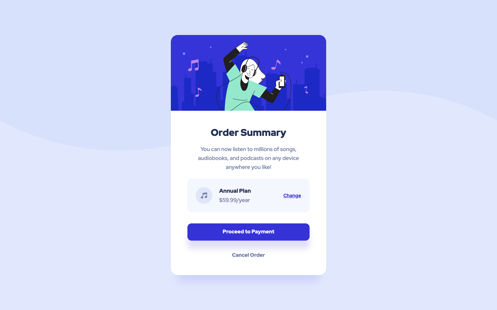

# Frontend Mentor - Order summary card solution

This is a solution to the [Order summary card challenge on Frontend Mentor](https://www.frontendmentor.io/challenges/order-summary-component-QlPmajDUj). Frontend Mentor challenges help you improve your coding skills by building realistic projects.

## Table of contents

- [Overview](#overview)
  - [The challenge](#the-challenge)
  - [Screenshot](#screenshot)
  - [Links](#links)
  - [Built with](#built-with)
  - [What I learned](#what-i-learned)
  - [Continued development](#continued-development)
- [Author](#author)

## Overview

For this challenge, the task was to create a order summary component that one might see when subscribing to a monthly service, like Spotify. In addition to implementing hover states on certain clickable elements, the website should also be responsive to different screen sizes.
### The challenge

Users should be able to:

- See hover states for interactive elements

### Screenshot

### Links

- Solution URL: [Add solution URL here](https://your-solution-url.com)
- Live Site URL: [Add live site URL here](https://your-live-site-url.com)

### Built with

- Semantic HTML5 markup
- CSS custom properties
- Flexbox
### What I learned

Although this is a beginner challenge, as someone who is self-taught and has only begun studying coding since the start of the summer, this took me a lot longer than I had expected. But overall, I learned a lot. Here's some of the things I learned:
- using percentages to help with responsiveness
- using css variables and media queries
- using devTools in the browser
- how to take time off from working to give my mind some space to relax and not get so overwhelmed and frustrated (lol)
- css flexbox
- how to properly use git & github

Overall, I feel like this was a well-rounded project, in that I got to test a lot of my skills that I've learned this past month and a half. I know there are still a ton of issues regarding total responsiveness and accessibility, but I am still proud of myself for having come this far in such a short time, and all on my own too! :D

I realized with this project that I can be really hard on myself when I can't figure something out so this project was also somewhat ~~introspective~~ because I got to learn more about by work habits and how to go about improving them.
### Continued development

I want to continue working with flexbox and media queries as I found this the most tasking and frustrating part. I also want to get better at keeping my code DRY as many of you will probably see that my code is a rambling mess in a lot of places (much like my thoughts lol) so that is definitely something I want to work on.

In researching for this project, I stumbled upon different css methodologies one can implement to make the process of writing css flow a little smoother and more intuitively. Those are more things I plan on looking into as a result of this project.

## Author

- Website - my portfolio website :p (https://www.mikaelaortiz.myportfolio.com)
- Frontend Mentor - @mikaela-o (https://www.frontendmentor.io/profile/mikaela-o)
